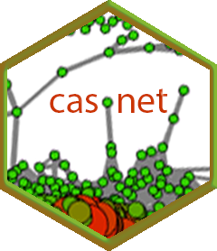

# Disclaimer: **VERY BETA**

[](https://travis-ci.org/FredHasselman/casnet)
[](https://ci.appveyor.com/project/FredHasselman/casnet)
[](https://cran.r-project.org/package=casnet)
[](https://www.tidyverse.org/lifecycle/#experimental)


# **casnet**: An R toolbox for studying Complex Adaptive Systems and NETworks 

A collection of analytic tools for studying signals recorded from complex adaptive systems or networks:

* Recurrence Quantification Analyses (CrossRQA, Categorical RQA, Chromatic RQA, Anisotropic RQA)
* Fluctuation Analyses (DFA varieties, PSD slope, SDA, Multifractal DFA, Wavelet Singularity Spectrum)
* Coupling Analyses (Cross Conformal Mapping, Detection of Coupling Direction, CRQA)
* Network based time series analyses (Recurrence Networks, Multifractal Spectrum Networks)
* SOON: Multiplex Recurrence Networks


## Installing **casnet**

Either use `devtools::install_github` or download the tar/zip

### Use `devtools`

Install directly from Github and check if the vignettes were installed.

```
library(devtools)
install_github("FredHasselman/casnet", build_vignettes = TRUE)
vignette("cl_RQA")
```

### Vignette build failing?

If  building the vignettes fails on installation, just omit the argument and locate the vignettes in the `inst/docs/` folder of the repository.
