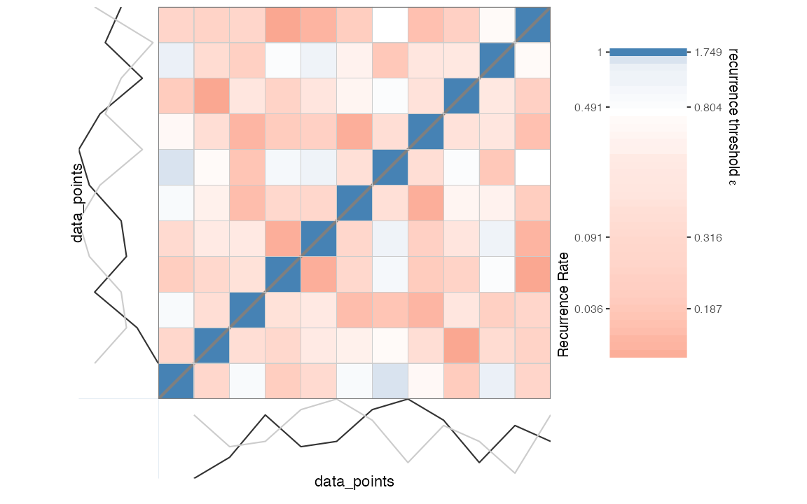
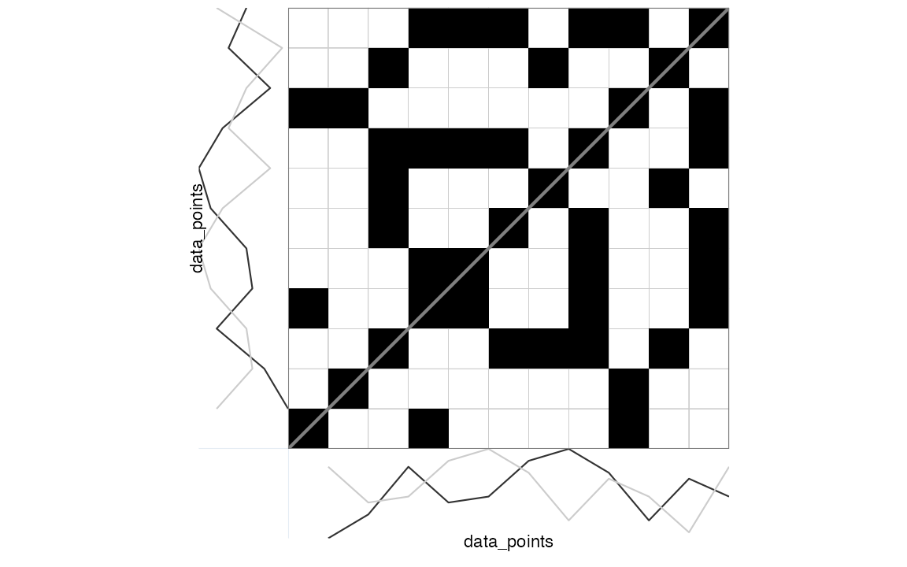

# Recurrence Quantification Analysis

This vignette discusses how to conduct a large variety of
recurrence-based time series analyses using R-package *casnet*. It is
not the only `R` package that can run recurrence analyses, the closest
alternative in `R` to `casnet` is probably package
[`crqa`](https://cran.r-project.org/web/packages/crqa/index.html). It
has a great tutorial paper by \[@coco2014\]). Several other packages
have dedicated functions, e.g. package `nonlinearTseries` has a function
`RQA`. There are also many options outside of the `R` framework, see the
[Recurrence Plot webpage](http://www.recurrence-plot.tk/programmes.php)
for a comprehensive list of software.

There are 3 ways to run Recurrence Quantification Analyses in `casnet`:

- Using functions `rp`, `rp_measures` and `rp_plot`. These functions use
  a thresholded distance matrix known as a recurrence plot to calculate
  RQA measures. Use these functions if your time series length is around
  `2000` data points or less.
- Using function `rqa_par`, which does not construct a distance matrix,
  but processes matrix diagonals in parallel. The function is very fast
  and can handle very large time series.
- Using function `rqa_cl` which will run Norbert Marwan’s [commandline
  Recurrence Plots](http://tocsy.pik-potsdam.de/commandline-rp.php). You
  can run this if your OS allows execution of 32 bit command line
  executable.

The following examples will demonstrate the basic use of the native
`casnet` functions based on the `rqa_par` and `rp` families of
functions, see the paragraph [An R interface to Marwan’s commandline
recurrence plots](#marwan) to learn about using `rqa_cl()` and [An R
interface to Marwan’s commandline recurrence plots](#marwan).

To learn more about the different types of Recurrence Quantification
Analysis that can be conducted in `casnet` please see the chapters on
RQA in the Complex Systems Approach book for more details:

- [RQA on unordered categorical
  data](https://complexity-methods.github.io/book/unordered-categorical-data.html)

- [RQA on continuous
  data](https://complexity-methods.github.io/book/lvSystem.html)

## RQA based on a matrix: `rp()`

### Unordered categorical data

``` r
emDim   <- 1
emLag   <- 1
emRad   <- 0
theiler <- 0 # Do not include the diagonal
```

### Continuous data

We’ll use the examples used in the manual of the
[PyRQA](https://pypi.org/project/PyRQA/) library for Python. This is
convenient, the parameters `emDim`, `emLag` and `emRad` are already
given (see [the CSA
book](https://complexity-methods.github.io/book/lvSystem.html) for
examples on how to estimate them with `casnet`) and it allows for a
comparison of the output.

``` r
# PyRQA example data
data_points <- as.numeric(c(0.1, 0.5, 1.3, 0.7, 0.8, 1.4, 1.6, 1.2, 0.4, 1.1, 0.8, 0.2, 1.3))

plot(ts(data_points), type = "b")
```


First, we create a distance matrix based on the (delay embedded) time
series and decide on a threshold criterion to turn it into a recurrence
matrix of `0`s and `1`s. We already have a radius given in the PyRQA
example, using a convenient graphical tool for visual inspection of the
relationship between different thresholds values and the resulting
recurrence rate (`RR`), we can check what this radius will yield.

``` r
library(casnet)

emDim   <- 2
emLag   <- 2
emRad   <- 0.65

RM <- rp(y1 = data_points, emDim = emDim, emLag = emLag)
rp_plot(RM, plotDimensions = TRUE, drawGrid = TRUE)
```



The code below applies the threshold `emRad` to the distance matrix,
which generates a sparse matrix (class `dgcMatrix`, see package
\[Matrix\]).

``` r
(RM <- rp(y1 = data_points, emDim = emDim, emLag = emLag, emRad = emRad))
```

    > 11 x 11 sparse Matrix of class "dgCMatrix"
    >                            
    >  [1,] . . . 1 . . . . 1 . .
    >  [2,] . . . . . . . . 1 . .
    >  [3,] . . . . . 1 1 1 . 1 .
    >  [4,] 1 . . . 1 . . 1 . . 1
    >  [5,] . . . 1 . . . 1 . . 1
    >  [6,] . . 1 . . . . 1 . . 1
    >  [7,] . . 1 . . . . . . 1 .
    >  [8,] . . 1 1 1 1 . . . . 1
    >  [9,] 1 1 . . . . . . . . 1
    > [10,] . . 1 . . . 1 . . . .
    > [11,] . . . 1 1 1 . 1 1 . .

The relevant analysis parameters, including the embedded series, are
stored as attributes of the matrix object.

``` r
attributes(RM)
```

    > $i
    >  [1]  3  8  8  5  6  7  9  0  4  7 10  3  7 10  2  7 10  2  9  2  3  4  5 10  0
    > [26]  1 10  2  6  3  4  5  7  8
    > 
    > $p
    >  [1]  0  2  3  7 11 14 17 19 24 27 29 34
    > 
    > $Dim
    > [1] 11 11
    > 
    > $Dimnames
    > $Dimnames[[1]]
    > NULL
    > 
    > $Dimnames[[2]]
    > NULL
    > 
    > 
    > $x
    >  [1] 1 1 1 1 1 1 1 1 1 1 1 1 1 1 1 1 1 1 1 1 1 1 1 1 1 1 1 1 1 1 1 1 1 1
    > 
    > $factors
    > list()
    > 
    > $class
    > [1] "dgCMatrix"
    > attr(,"package")
    > [1] "Matrix"
    > 
    > $method
    > [1] "Euclidean"
    > 
    > $call
    > proxy::dist(x = et1, y = et2, method = method, diag = TRUE)
    > 
    > $AUTO
    > [1] TRUE
    > 
    > $emRad
    > [1] 0.65
    > 
    > $NAij
    > [1] NA
    > 
    > $theiler
    > [1] 1
    > 
    > $emDims1
    >       tau.0 tau.1
    >  [1,]   0.1   1.3
    >  [2,]   0.5   0.7
    >  [3,]   1.3   0.8
    >  [4,]   0.7   1.4
    >  [5,]   0.8   1.6
    >  [6,]   1.4   1.2
    >  [7,]   1.6   0.4
    >  [8,]   1.2   1.1
    >  [9,]   0.4   0.8
    > [10,]   1.1   0.2
    > [11,]   0.8   1.3
    > attr(,"embedding.dims")
    > [1] 2
    > attr(,"embedding.lag")
    > [1] 2
    > attr(,"embedding.time")
    > [1] 2
    > attr(,"variable.y")
    > [1] "data_points"
    > 
    > $emDims2
    >       tau.0 tau.1
    >  [1,]   0.1   1.3
    >  [2,]   0.5   0.7
    >  [3,]   1.3   0.8
    >  [4,]   0.7   1.4
    >  [5,]   0.8   1.6
    >  [6,]   1.4   1.2
    >  [7,]   1.6   0.4
    >  [8,]   1.2   1.1
    >  [9,]   0.4   0.8
    > [10,]   1.1   0.2
    > [11,]   0.8   1.3
    > attr(,"embedding.dims")
    > [1] 2
    > attr(,"embedding.lag")
    > [1] 2
    > attr(,"embedding.time")
    > [1] 2
    > attr(,"variable.y")
    > [1] "y2"
    > 
    > $emDims1.name
    > [1] "data_points"
    > 
    > $emDims2.name
    > [1] "y2"
    > 
    > $embedded
    > [1] TRUE
    > 
    > $emLag
    > [1] 2
    > 
    > $emDim
    > [1] 2
    > 
    > $measures
    > [1] NA
    > 
    > $weighted
    > [1] FALSE
    > 
    > $weightedBy
    > [1] "si"
    > 
    > $chromatic
    > [1] FALSE
    > 
    > $chromaNames
    > [1] NA
    > 
    > $chromaDims
    > [1] NA

It is custom to represent the recurrence matrix as a plot with
coordinate `(1,1)` in the left lower corner.

``` r
rp_plot(RM, plotDimensions = TRUE, drawGrid = TRUE)
```



Because this analysis concerns Auto-RQA, the diagonal is usually
excluded from the calculations of RQA measures. This can be achieved by
setting the `theiler` parameter to `1`. This is in fact the default
behavior in `casnet` if the `theiler` argument is `NA` and the
recurrence matrix is detected to be symmetrical.

``` r
# Current value of theiler
attributes(RM)$theiler
```

    > [1] 1

``` r
# Values on the diagonal
Matrix::diag(RM)
```

    >  [1] 0 0 0 0 0 0 0 0 0 0 0

``` r
# To explicitly include the diagonal in calculations set theiler to 0
(RM <- rp(y1 = data_points, emDim = emDim, emLag = emLag, emRad = emRad, theiler = 0))
```

    > 11 x 11 sparse Matrix of class "dgCMatrix"
    >                            
    >  [1,] 1 . . 1 . . . . 1 . .
    >  [2,] . 1 . . . . . . 1 . .
    >  [3,] . . 1 . . 1 1 1 . 1 .
    >  [4,] 1 . . 1 1 . . 1 . . 1
    >  [5,] . . . 1 1 . . 1 . . 1
    >  [6,] . . 1 . . 1 . 1 . . 1
    >  [7,] . . 1 . . . 1 . . 1 .
    >  [8,] . . 1 1 1 1 . 1 . . 1
    >  [9,] 1 1 . . . . . . 1 . 1
    > [10,] . . 1 . . . 1 . . 1 .
    > [11,] . . . 1 1 1 . 1 1 . 1

``` r
attributes(RM)$theiler
```

    > NULL

In `casnet` the `theiler` correction will affect *all* calculations.
This is different from, for example, PyRQA where it only affects the
recurrence rate and measures based on diagonal line structures. Below
are the results reported in the online [PyRQA
manual](https://pypi.org/project/PyRQA/#usage), with the diagonal
included:

    RQA Result:
    ===========

    Minimum diagonal line length (L_min): 2
    Minimum vertical line length (V_min): 2
    Minimum white vertical line length (W_min): 2

    Recurrence rate (RR): 0.371901
    Determinism (DET): 0.411765
    Average diagonal line length (L): 2.333333
    Longest diagonal line length (L_max): 3
    Divergence (DIV): 0.333333
    Entropy diagonal lines (L_entr): 0.636514
    Laminarity (LAM): 0.400000
    Trapping time (TT): 2.571429
    Longest vertical line length (V_max): 4
    Entropy vertical lines (V_entr): 0.955700
    Average white vertical line length (W): 2.538462
    Longest white vertical line length (W_max): 6
    Longest white vertical line length inverse (W_div): 0.166667
    Entropy white vertical lines (W_entr): 0.839796

    Ratio determinism / recurrence rate (DET/RR): 1.107190
    Ratio laminarity / determinism (LAM/DET): 0.971429

The same for `casnet`:

``` r
# Including diagonal
RM <- rp(y1 = data_points, emDim = emDim, emLag = emLag, emRad = emRad, theiler = 0)
out_rqa <- rp_measures(RM, silent = FALSE)
```

    > 
    > ~~~o~~o~~casnet~~o~~o~~~
    >  Global Measures
    >   Global Max.points N.points    RR Singular Divergence Repetitiveness
    > 1 Matrix        110       45 0.409       20      0.333              2
    > 
    > 
    >  Line-based Measures
    >        Lines N.lines N.points Measure  Rate Mean Max.   ENT ENT_rel   CoV
    > 1   Diagonal       6       14     DET 0.311 2.33    3 0.637   0.265 0.221
    > 2   Vertical       5       14   V LAM 0.311 2.80    4 1.055   0.440 0.299
    > 3 Horizontal       5       14   H LAM 0.311 2.80    4 1.055   0.440 0.299
    > 4  V+H Total      10       28 V+H LAM 0.311 2.80    4 1.055   0.440 0.282
    > 
    > ~~~o~~o~~casnet~~o~~o~~~

Below is a comparison of the output from
[`casnet::rp()`](../reference/rp.md) and `PyRQA`. Note that `PyRQA`
includes the main diagonal for `RR` and measures based on vertical (and
horizontal) lines.

[TABLE]

## RQA based on massively parallel processing: `rqa_par()`

`PyRQA` was developed to perform RQA on very long time series, without
overloading memory and inflating the computing time to a degree that is
unmanageable in a regular workflow. It is not recommended to use matrix
based functions like
[`casnet::rp_measures()`](../reference/rp_measures.md) on time series
larger than `5,000` data points, instead,
[`casnet::rqa_par()`](../reference/rqa_par.md) can be used, which
implements some of the methods used in `PyRQA`. Specifically, the memory
management by limiting the precision (package \[float\]) and using bit
compression (package \[float\]), as well as by computing RQA measures in
a massively parallel way (package \[parallel\]). Compared to
[`casnet::rqa_par()`](../reference/rqa_par.md),`PyRQA` is still faster,
but this difference becomes noticeable for very large time series
(`>100,000`).

``` r
noise <- casnet::noise_powerlaw(N=10000, seed = 1234)
plot(ts(noise),type = "l")
```


``` r
#est_radius_rqa(ts_embed(noise, emDim = emDim, emLag = emLag), noise, AUTO = TRUE)
```

    RQA Result:
    ===========

    Minimum diagonal line length (L_min): 2
    Minimum vertical line length (V_min): 2
    Minimum white vertical line length (W_min): 2

    Recurrence rate (RR): 0.049585
    Determinism (DET): 0.230880
    Average diagonal line length (L): 2.149236
    Longest diagonal line length (L_max): 7
    Divergence (DIV): 0.142857
    Entropy diagonal lines (L_entr): 0.443727
    Laminarity (LAM): 0.374149
    Trapping time (TT): 2.305511
    Longest vertical line length (V_max): 8
    Entropy vertical lines (V_entr): 0.709903
    Average white vertical line length (W): 28.154700
    Longest white vertical line length (W_max): 9079
    Longest white vertical line length inverse (W_div): 0.000110
    Entropy white vertical lines (W_entr): 3.909756

    Ratio determinism / recurrence rate (DET/RR): 4.656240
    Ratio laminarity / determinism (LAM/DET): 1.620535

``` r
# Including diagonal
# emRad <- est_radius(rp(noise,emDim = emDim, emLag = emLag))
emLag <- 100
emDim <- 2
emRad <- .00018
out_rqa_par <-  casnet::rqa_par(y1 = noise, AUTO = TRUE, emDim = emDim, emLag = emLag, emRad = emRad, silent = FALSE, theiler = 0)
```

    > 
    > ~~~o~~o~~casnet~~o~~o~~~
    >  Global Measures
    >   Global Max.points N.points     RR Singular Divergence Repetitiveness
    > 1 Matrix    9.8e+07  4860604 0.0496  3730640   0.000101           3.22
    > 
    > 
    >  Line-based Measures
    >        Lines N.lines N.points Measure  Rate Mean Max.   ENT ENT_rel   CoV
    > 1   Diagonal  521141  1129964     DET 0.232 2.17 9900 0.444  0.0482 6.326
    > 2   Vertical  788863  1818770   V LAM 0.374 2.31    8 0.710  0.0772 0.269
    > 3 Horizontal  788863  1818770   H LAM 0.374 2.31    8 0.710  0.0772 0.269
    > 4  V+H Total 1577726  3637540 V+H LAM 0.374 2.31    8 0.710  0.0772 0.269
    > 
    > ~~~o~~o~~casnet~~o~~o~~~

[TABLE]

## An R interface to Marwan’s commandline recurrence plots

> **IMPORTANT**: Currently `rp_cl` can only run on an operating system
> that allows execution of 32-bit applications!

The [`crqa_cl()`](../reference/rp_cl.md) function is a wrapper for the
[commandline Recurrence
Plots](http://tocsy.pik-potsdam.de/commandline-rp.php) executable
provided by Norbert Marwan.

The `rp` executable file is installed on your machine when the function
[`rp_cl()`](../reference/rp_cl.md) is called for the first time:

- It is renamed to `rp` from a platform specific file downloaded from
  the [commandline Recurrence
  Plots](http://tocsy.pik-potsdam.de/commandline-rp.php) site.
- The file is copied to the directory:
  `normalizePath("[path to casnet]/exec/",mustWork = FALSE)`
  - Make sure that you have rights to execute programs in this
    directory!
- The latter location is stored as an option and can be read by calling
  `getOption("casnet.path_to_rp")`

If you cannot change the permissions on the folder where `rp` was
downloaded, consider downloading the appropriate executable from the
[commandline Recurrence
Plots](http://tocsy.pik-potsdam.de/commandline-rp.php) site to a
directory in which you have such permissions. Then change the
`path_to_rp` option using
`options(casnet.path_to_rp="YOUR_PATH_TO_RP")`. See the manual entry for
[`rp_cl()`](../reference/rp_cl.md) for more details.

------------------------------------------------------------------------

The platform specific `rp` command line executable files were created by
Norbert Marwan and obtained under a Creative Commons License from the
website of the Potsdam Institute for Climate Impact Research at:
<http://tocsy.pik-potsdam.de/>

The full copyright statement on the website is as follows:

> © 2004-2017 SOME RIGHTS RESERVED  
> University of Potsdam, Interdisciplinary Center for Dynamics of
> Complex Systems, Germany  
> Potsdam Institute for Climate Impact Research, Transdisciplinary
> Concepts and Methods, Germany  
> This work is licensed under a [Creative Commons
> Attribution-NonCommercial-NoDerivs 2.0 Germany
> License](https://creativecommons.org/licenses/by-nc-nd/2.0/de/).

More information about recurrence quantification analysis can be found
on the [Recurrence Plot website](http://www.recurrence-plot.tk).

## Computational load: The Python solution \[PyRQA\]

When the time series you analyze are very long, the recurrence matrix
will become very large and R will become very slow. One solution is to
use R to run the Python program
[`PyRQA`](https://pypi.org/project/PyRQA/) or perhaps
[`pyunicorn`](https://github.com/pik-copan/pyunicorn). The options for
`PyRQA` are limited compared to the casnet functions, but the gain in
processing speed is remarkable!

What follows is an example of how you could make `PyRQA` run in R using
the package `reticulate`.

#### Setup the environment

Suppose you are on a machine that has both `R` and `Python` installed
then the steps are:

- Make sure `Python` and `pip` are up to date
- Create a virtual (or a coda) environment.
- Install `PyRQA` into the virtual environment.

You should only have to create and setup the environment once.

``` r
library(reticulate)

# OS requirements
# Python3.X is installed and updated.
# On MacOS you'll probably need to run these commands in a Terminal window:
python3 pip install --update pip # Updates the Python module installer
python3 pip intall pyrqa # Installs the pyrqa module on your machine

# First make sure you use the latest Python version
# You can check your machine by calling: reticulate::py_discover_config()
reticulate::use_python("/usr/local/bin/python3")

# Create a new environment "r-reticulate", the path is stored in vEnv
# On Windows use coda_create() see the reticulate manual.
vEnv <- reticulate::virtualenv_create("r-reticulate")

# Install pyrqa into the virtual environment
reticulate::virtualenv_install("r-reticulate","pyrqa")

# If you wish to remove the environment use: reticulate::virtualenv_remove("r-reticulate")
```

After the environment is set up:

- Restart your R session and instruct the system to use Python in the
  virtual environment.
- Import `PyRQA` into your `R` session.
- Use the `PyRQA` functions that are now available as fields (`$`) of
  the imported object!

An important thing to note in the example below is the use of
[`as.integer()`](https://rdrr.io/r/base/integer.html) to pass integer
variables to Python.

``` r
# Make sure you associate reticulate with your virtual environment.
reticulate::use_virtualenv("r-reticulate", required = TRUE)

# Import pyrqa into your R session
pyrqa <- reticulate::import("pyrqa")

# Alternatively, you can import from a path in the virtual environment.
# On MacOS this will be a hidden folder in your home directory:
# '.virtualenvs/r-reticulate/lib/Python3.X/site-packages'
# pyrqa <- import_from_path(file.path(vEnv,"/lib/python3.9/site-packages"))

# Now perform RQA on your N = 10,000 time series!
Y <- cumsum(rnorm(10000))

# Automated parameter search will still take some time using casnet
system.time({
  emPar <- casnet::est_parameters(Y, doPlot = FALSE)
  emRad <- casnet::est_radius(y1 = Y, emLag = emPar$optimLag, emDim = emPar$optimDim)
  })
# user    system  elapsed 
# 299.732 89.094  393.620 

# About 5 minutes to find a delay, embedding dimension and radius yielding 5% recurrent points.

# Now do an RQA on the 10,000 x 10,000 matrix using Python
system.time({
time_series <- pyrqa$time_series$TimeSeries(Y, 
                                            embedding_dimension= as.integer(emPar$optimDim), 
                                            time_delay= as.integer(emPar$optimLag))
settings    <- pyrqa$settings$Settings(time_series, 
                                       analysis_type = pyrqa$analysis_type$Classic,
                                       neighbourhood = pyrqa$neighbourhood$FixedRadius(emRad$Radius),
                                       similarity_measure = pyrqa$metric$EuclideanMetric,
                                       theiler_corrector = 0)
computation <- pyrqa$computation$RQAComputation$create(settings)
result      <- computation$run()
})
# user   system  elapsed 
# 2.996  0.069   0.365 

# About 3 seconds for the analysis...
# That's really fast!

print(result)
```

    RQA Result:
    ===========

    Minimum diagonal line length (L_min): 2
    Minimum vertical line length (V_min): 2
    Minimum white vertical line length (W_min): 2

    Recurrence rate (RR): 0.050090
    Determinism (DET): 0.955821
    Average diagonal line length (L): 10.634044
    Longest diagonal line length (L_max): 9866
    Divergence (DIV): 0.000101
    Entropy diagonal lines (L_entr): 3.064460
    Laminarity (LAM): 0.969709
    Trapping time (TT): 14.930102
    Longest vertical line length (V_max): 345
    Entropy vertical lines (V_entr): 3.386939
    Average white vertical line length (W): 265.518914
    Longest white vertical line length (W_max): 9161
    Longest white vertical line length inverse (W_div): 0.000109
    Entropy white vertical lines (W_entr): 4.726210

    Ratio determinism / recurrence rate (DET/RR): 19.081989
    Ratio laminarity / determinism (LAM/DET): 1.014530

You can also save the Recurrence Plot.

``` r
RPcomputation <- pyrqa$computation$RPComputation$create(settings)
RPresult <- RPcomputation$run()
pyrqa$image_generator$ImageGenerator$save_recurrence_plot(RPresult$recurrence_matrix_reverse,'recurrence_plot_python.png')
```

``` r
knitr::include_graphics("recurrence_plot_python.png")
```


RP produced by PyRQA

## Other options: Julia

The Julia software has a number of very powerful packages to simulate
and analyze dynamical systems, see:
<https://juliadynamics.github.io/DynamicalSystems.jl/latest/>

You can perform RQA
(<https://juliadynamics.github.io/DynamicalSystems.jl/latest/tutorial/#State-space-sets>),
but perhaps more interestingly, you can use a powerful automatic
parameter selection algorithm for embedding called PECUZAL:
<https://juliadynamics.github.io/DelayEmbeddings.jl/stable/unified/>

I use the freely available software *Visual Studio Code* to write and
run Python (<https://code.visualstudio.com/docs/languages/python>) and
Julia (<https://code.visualstudio.com/docs/languages/julia>)
