# Quantifying Scaling Phenomena in Time Series

## **Global Scaling Phenomena**

> “If you have not found the 1/f spectrum, it is because you have not
> waited long enough. You have not looked at low enough frequencies.”

\- Machlup ([1981](#ref-machlup1981))

  
  
  

The family of fluctuation analyses all start with `fd_` and most of them
are based on quantifying a dependency of the magnitude of fluctuations
observed at different time scales.

The slope of time scale with fluctuation in log-log coordinates
represents the scaling exponent, which can be transformed into an
estimate of the Fractal Dimension. In `casnet` this conversion is
performed by applying the formula’s provided in ([Hasselman
2013](#ref-hasselman2013)).

[](https://www.frontiersin.org/journals/physiology/articles/10.3389/fphys.2013.00075/full)

Let’s create some noise series:

``` r
library(casnet)
set.seed(1)
y0 <- noise_powerlaw(alpha = -2, N = 1024)
y1 <- noise_powerlaw(alpha = -1, N = 1024)
y2 <- noise_powerlaw(alpha =  0, N = 1024)
y3 <- noise_powerlaw(alpha =  1, N = 1024)
y4 <- noise_powerlaw(alpha =  2, N = 1024)

plotTS_multi(data.frame(y0,y1,y2,y3,y4))
```

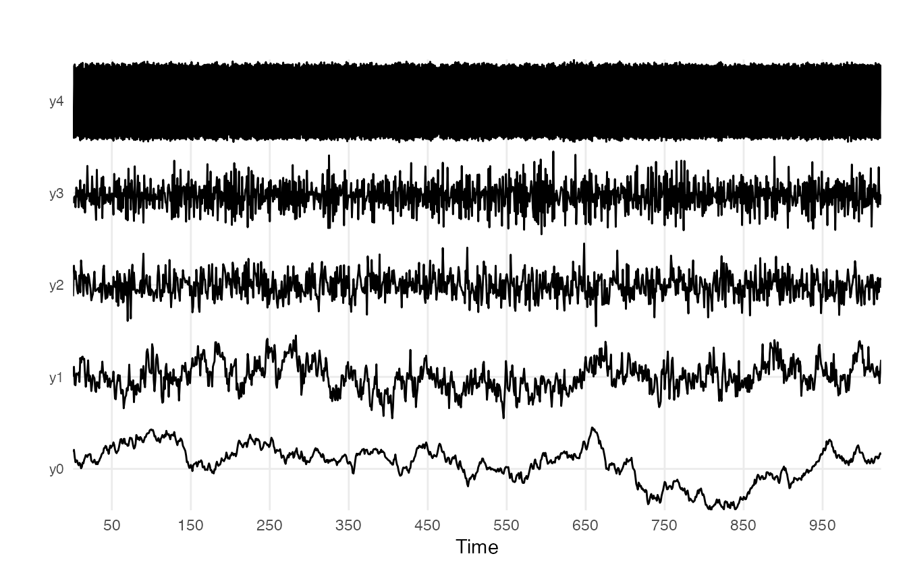

``` r
ts_list <- list(y0,y1,y2,y3,y4)
noiseNames <- c("y0: Brownian (red) noise", "y1: Pink noise", "y2: White noise", "y3: Blue noise" ,"y4: Violet noise")
```

### Standardised Dispersion Analysis (SDA)

In Standardised Dispersion Analysis, the time series is converted to
z-scores (standardised) and the way the average standard deviation (SD)
calculated in bins of a particular size scales with the bin size should
be an indication of the presence of power-laws. That is, if the bins get
larger and the variability decreases, there probably is no scaling
relation. If the SD systematically increases either with larger bin
sizes, or, in reverse, this means the fluctuations depend on the size of
the bins, the size of the measurement stick.

``` r
library(cowplot)

sdaPlots <- plyr::llply(seq_along(ts_list), function(t){
  fd_sda(ts_list[[t]],silent = TRUE, returnPlot = TRUE, noTitle = TRUE, 
         tsName = noiseNames[t])$plot
  })

cowplot::plot_grid(plotlist = sdaPlots, ncol = 1)
```

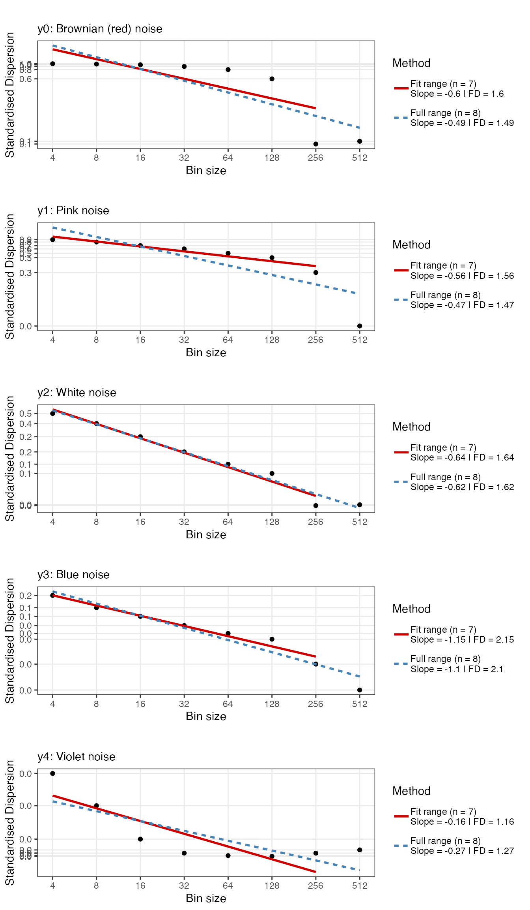

To increase the resolution of the bins adjust the argument
`scaleResolution` and/or the values of `scaleMin` and `scaleMax`

At a resolution of `32` there appear to be 2 scaling regions

``` r
t <- 2 # Pink noise
fd_sda(ts_list[[t]], silent = TRUE,  scaleResolution = 32, noTitle = TRUE, tsName = noiseNames[t], doPlot = TRUE)
```

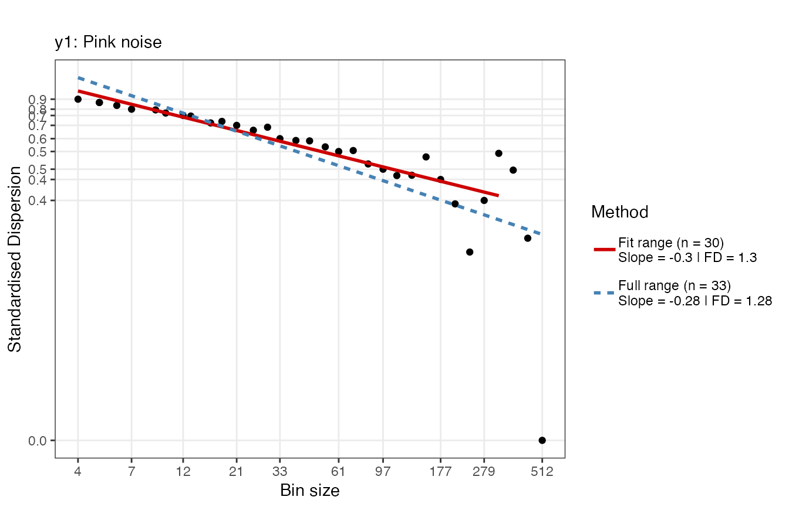

Below the argument `scaleMin`, which defaults to `4`, is used to adjust
the fit range.

``` r
fd_sda(ts_list[[t]],  silent = TRUE, scaleResolution = 32, scaleMin = 10, scaleMax = 256, noTitle = TRUE, tsName = noiseNames[t], doPlot = TRUE)
```

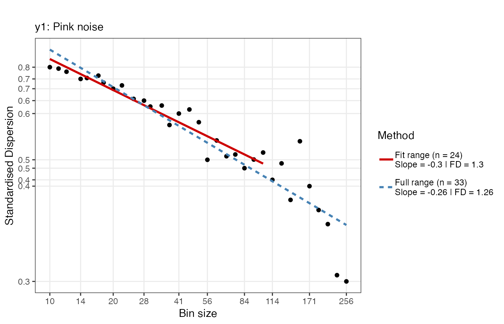

This is probably not a good idea…

``` r
fd_sda(ts_list[[t]], silent = TRUE, scaleResolution = 2, noTitle = TRUE, tsName = noiseNames[t], doPlot = TRUE)
```

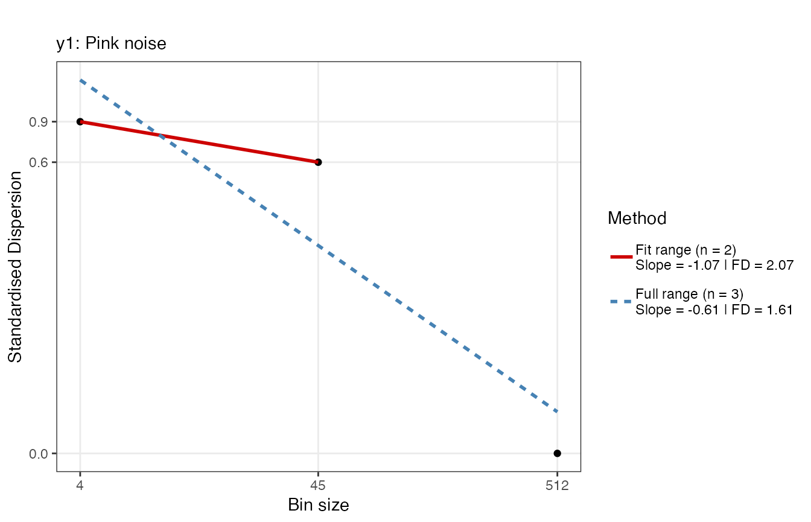

### Detrended Fluctuation Analysis (DFA)

The procedure for Detrended Fluctuation Analysis is similar to SDA,
except that within each bin, the signal is first detrended, what remains
is then considered the residual variance (see e.g., [Kantelhardt et al.
2002](#ref-kantelhardt2002)). The logic is the same, the way the average
residual variance scales with the bin size should be an indication of
the presence of power-laws. There are many different versions of DFA,
one can choose to detrend polynomials of a higher order, or even detrend
using the best fitting model, which is decided for each bin
individually. See the manual pages of
[`fd_dfa()`](../reference/fd_dfa.md) for details.

``` r
dfaPlots <- plyr::llply(seq_along(ts_list), function(t){
  fd_dfa(ts_list[[t]],silent = TRUE, returnPlot = TRUE, noTitle = TRUE, 
         tsName = noiseNames[t])$plot
  })

cowplot::plot_grid(plotlist = dfaPlots, ncol = 1)
```

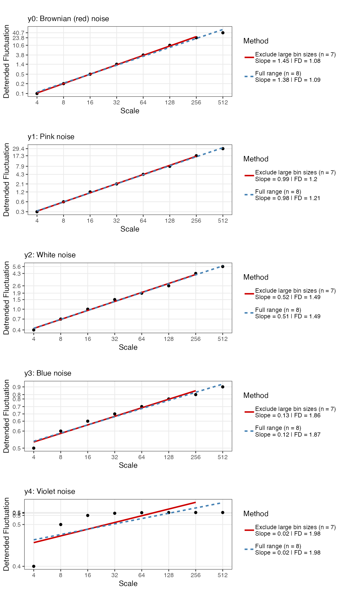

For more customization options, use function
[`plotFD_loglog()`](../reference/plotFD_loglog.md), make sure to return
the Power Law in the output by setting `returnPLAW = TRUE`. You could
use [`plotFD_loglog()`](../reference/plotFD_loglog.md) or create your
own figure based on the data in the `PLAW` field of the output.

``` r
dfa0a <- fd_dfa(y0, silent = TRUE, returnPLAW = TRUE)
plotFD_loglog(dfa0a, title = "Custom title",  subtitle = "Custom subtitle", xlabel = "X", ylabel = "Y")
```

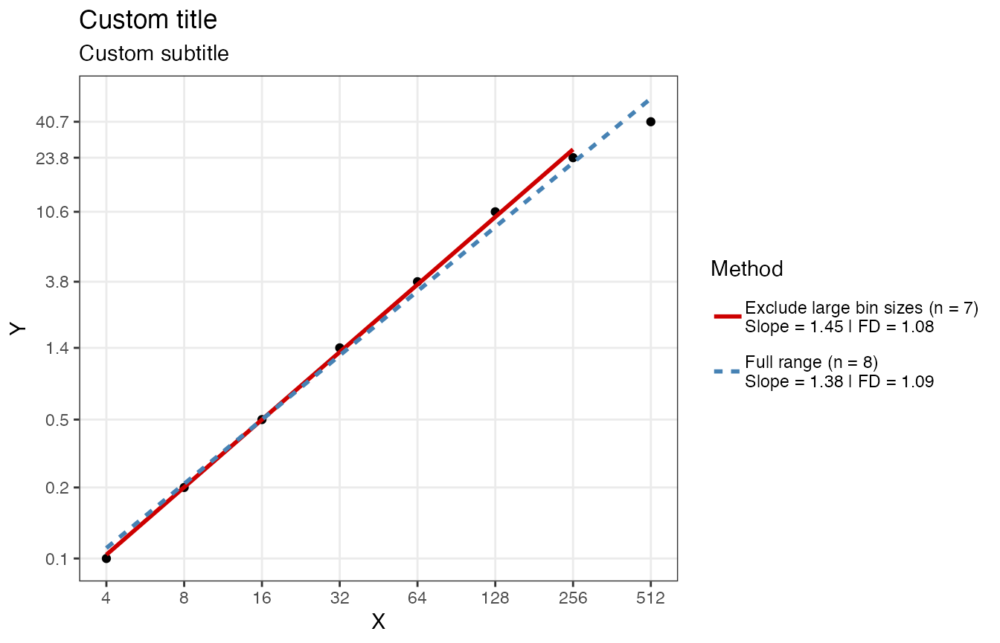

### Power Spectral Density Slope (PSD slope)

``` r
psd0 <- fd_psd(y0, silent = TRUE, returnPlot = TRUE, noTitle = TRUE, tsName = "y0: Brownian (red) noise")
psd1 <- fd_psd(y1, silent = TRUE, returnPlot = TRUE, noTitle = TRUE, tsName = "y1: Pink noise")
psd2 <- fd_psd(y2, silent = TRUE, returnPlot = TRUE, noTitle = TRUE, tsName = "y2: White noise")
psd3 <- fd_psd(y3, silent = TRUE, returnPlot = TRUE, noTitle = TRUE, tsName = "y3: Blue noise")
psd4 <- fd_psd(y4, silent = TRUE, returnPlot = TRUE, noTitle = TRUE, tsName = "y4: Violet noise")

cowplot::plot_grid(plotlist = list(psd0$plot,psd1$plot,psd2$plot,psd3$plot,psd4$plot), ncol = 1)
```

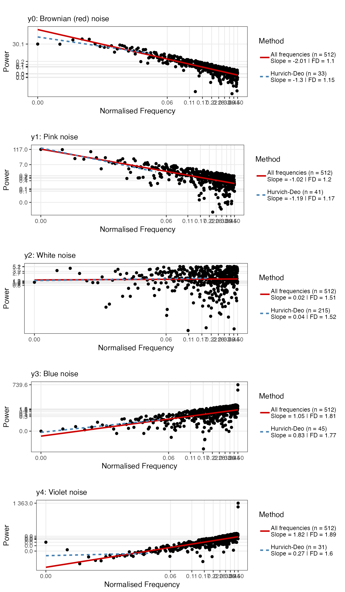

### Windowed Analysis: Brownian noise to white noise

``` r
library(tidyverse)
set.seed(1234)

y <- rnorm(1024)
y[513:1024] <- cumsum(y[513:1024])

id <- ts_windower(y = y, win = 256, step = 1, alignment = "r")

DFAseries <- plyr::ldply(id, function(w){
fd <- fd_dfa(y[w], silent = TRUE)
return(fd$fitRange$FD)
})

df_FD <- data.frame(time = 1:1024, y = y, FD = c(rep(NA,255), DFAseries$`DFAout$PLAW$size.log2[fitRange]`)) %>% 
  pivot_longer(cols = 2:3, names_to = "Variable", values_to = "Value")

df_FD$Variable <- relevel(factor(df_FD$Variable), ref = "y")

ggplot(df_FD, aes(x = time, y = Value)) +
  geom_line() +
  geom_hline(data = df_FD %>% filter(Variable == "FD"), aes(yintercept = c(1.1)), colour = "brown") +
  geom_hline(data = df_FD %>% filter(Variable == "FD"), aes(yintercept = c(1.5)), colour = "grey") +
  geom_vline(xintercept = 512, linetype = 2) +
  facet_grid(Variable~., scales = "free_y") +
  theme_bw()
```

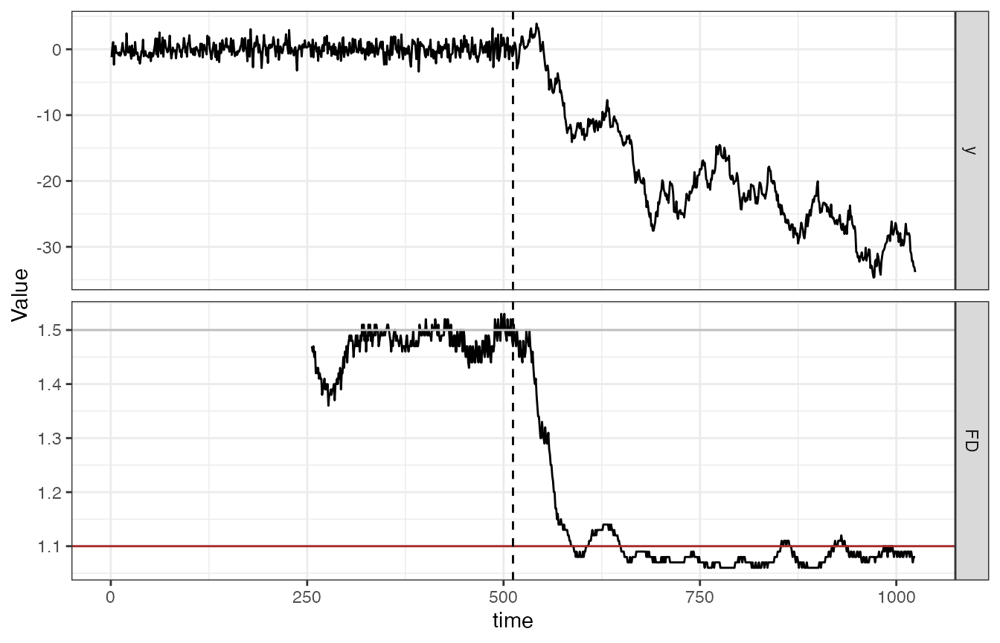

## Local Scaling Phenomena: Multi fractal DFA

Function [`fd_mfdfa()`](../reference/fd_mfdfa.md) should reproduce
results similar to the Matlab code provided by ([Ihlen
2012](#ref-ihlen2012)).

### Mono fractal

``` r
set.seed(33)

# White noise
fd_mfdfa(noise_powerlaw(alpha = 0, N=4096), doPlot = TRUE)
```

    > 
    > 
    > (mf)dfa:  Sample rate was set to 1.

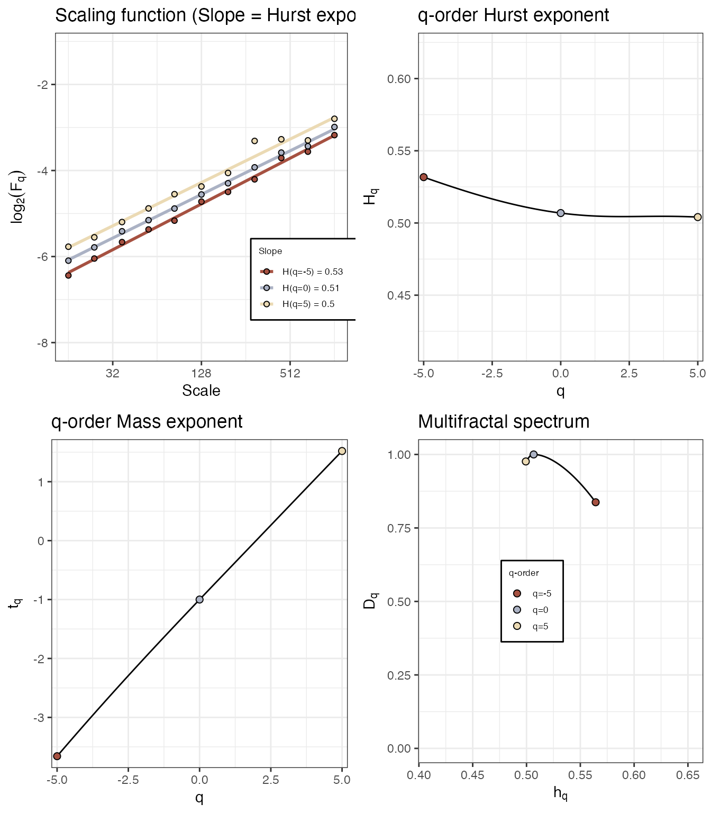

    > 
    > ~~~o~~o~~casnet~~o~~o~~~
    > 
    >  Multifractal Detrended FLuctuation Analysis 
    > 
    >   Spec_AUC Spec_Width Spec_CVplus Spec_CVmin Spec_CVtot Spec_CVasymm
    > 1   0.0615     0.0649     0.00597     0.0524     0.0435       -0.795
    > 
    > 
    > ~~~o~~o~~casnet~~o~~o~~~

``` r
# Pink noise
fd_mfdfa(noise_powerlaw(alpha = -1, N=4096), doPlot = TRUE)
```

    > 
    > 
    > (mf)dfa:  Sample rate was set to 1.

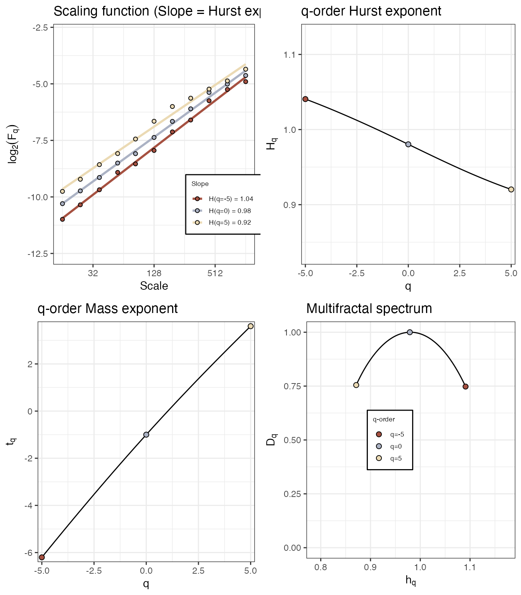

    > 
    > ~~~o~~o~~casnet~~o~~o~~~
    > 
    >  Multifractal Detrended FLuctuation Analysis 
    > 
    >   Spec_AUC Spec_Width Spec_CVplus Spec_CVmin Spec_CVtot Spec_CVasymm
    > 1    0.202       0.22      0.0868     0.0883      0.087     -0.00877
    > 
    > 
    > ~~~o~~o~~casnet~~o~~o~~~

### ‘Multi’ fractal

Function [`fd_mfdfa()`](../reference/fd_mfdfa.md)

``` r
# 'multi' fractal
N <- 2048
y <- rowSums(data.frame(elascer(noise_powerlaw(N=N, alpha = -2)), elascer(noise_powerlaw(N=N, alpha = -.5))*c(rep(.2,512),rep(.5,512),rep(.7,512),rep(1,512))))


fd_mfdfa(y=y, doPlot = TRUE)
```

    > 
    > 
    > (mf)dfa:  Sample rate was set to 1.

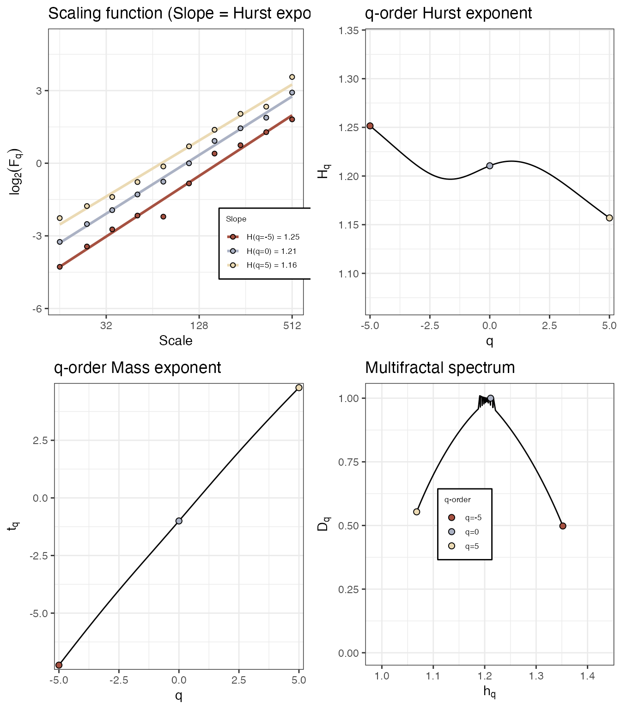

    > 
    > ~~~o~~o~~casnet~~o~~o~~~
    > 
    >  Multifractal Detrended FLuctuation Analysis 
    > 
    >   Spec_AUC Spec_Width Spec_CVplus Spec_CVmin Spec_CVtot Spec_CVasymm
    > 1    0.226      0.284       0.176      0.202      0.189      -0.0696
    > 
    > 
    > ~~~o~~o~~casnet~~o~~o~~~

For more information on how to use the output from multi-fractal DFA in
you studies see e.g. ([Kelty-Stephen et al.
2013](#ref-kelty-stephen2013); [Hasselman 2015](#ref-hasselman2015)).

### **References**

Hasselman, Fred. 2013. “When the Blind Curve Is Finite: Dimension
Estimation and Model Inference Based on Empirical Waveforms.” *Frontiers
in Physiology* 4: 75.

———. 2015. “Classifying Acoustic Signals into Phoneme Categories:
Average and Dyslexic Readers Make Use of Complex Dynamical Patterns and
Multifractal Scaling Properties of the Speech Signal.” *PeerJ* 3: e837.

Ihlen, Espen A F. 2012. “Introduction to Multifractal Detrended
Fluctuation Analysis in Matlab.” *Frontiers in Physiology*.
<http://www.ncbi.nlm.nih.gov/pmc/articles/pmc3366552/>.

Kantelhardt, Jan W, S Zschiegner, E Koscielnybunde, S Havlin, A Bunde,
and H Stanley. 2002. “Multifractal Detrended Fluctuation Analysis of
Nonstationary Time Series.” *Physica A: Statistical Mechanics and Its
Applications* 316 (1-4): 87114.
<https://doi.org/10.1016/S0378-4371(02)01383-3>.

Kelty-Stephen, Damian G., Kinga Palatinus, Elliot Saltzman, and James a.
Dixon. 2013. “A Tutorial on Multifractality, Cascades, and Interactivity
for Empirical Time Series in Ecological Science.” *Ecological
Psychology* 25 (1): 162.
<http://www.tandfonline.com/doi/abs/10.1080/10407413.2013.753804>.

Machlup, S. 1981. “Earthquakes, Thunderstorms and Other 1/f Noises.” In,
edited by P. H. E. Meijer, R. D. Mountain, and R. J. Soulen, 614:157–60.
Washington, DC: National Bureau of Standards.
<https://nvlpubs.nist.gov/nistpubs/Legacy/SP/nbsspecialpublication614.pdf#page=169>.
